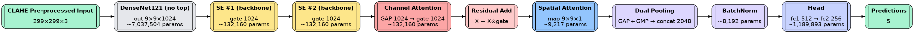
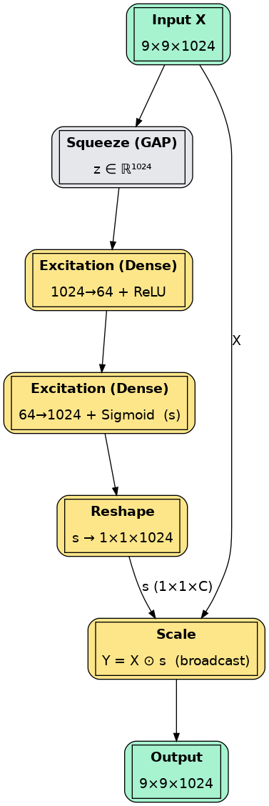
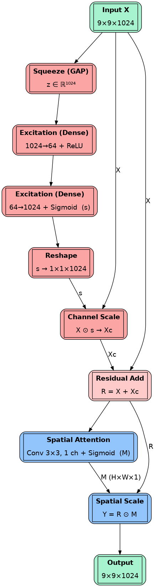
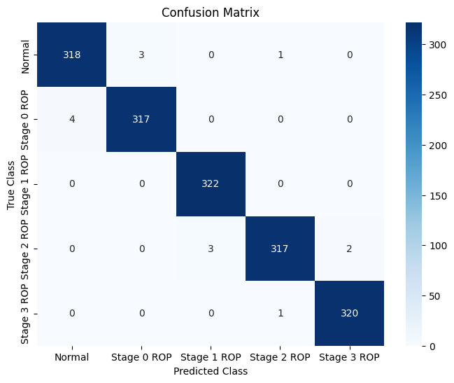
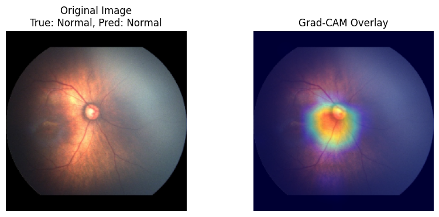

# 🔬 ROP Detection: Deep Learning for Retinopathy of Prematurity Classification

<p align="center">
  
</p>

[](https://www.python.org/downloads/)
[](https://www.tensorflow.org/)
[](LICENSE)

## 📋 Overview

This repository contains the implementation of a deep learning framework for automated **Retinopathy of Prematurity (ROP)** staging from fundus images. The model architecture combines:

- **DenseNet121** backbone with ImageNet pre-trained weights
- **Squeeze-and-Excitation (SE) blocks** for channel attention
- **Residual Attention Network Block (RANB)** for enhanced feature refinement
- **Dual Global Pooling (GAP + GMP)** for robust feature aggregation

The system achieves **99.75% validation accuracy** on ROP fundus image classification across 4 stages.

## 🏗️ Architecture

<p align="center">
  
  
</p>

### Key Components

1. **DenseNet121 Backbone**: Dense connectivity pattern for efficient feature reuse
2. **SE Blocks**: Adaptive channel-wise feature recalibration
3. **RANB**: Combined channel and spatial attention with residual connections
4. **Dual Pooling**: Captures both average and maximum activations
5. **CLAHE Preprocessing**: Contrast Limited Adaptive Histogram Equalization for enhanced image quality

## 📁 Project Structure

```
ROP/
├── 📂 configs/
│   └── config.yaml           # Training and model configuration
├── 📂 figures/               # Architecture diagrams and result figures
│   ├── model.png
│   ├── se2.png
│   ├── ranb.png
│   ├── clahe.png
│   ├── cm_densenet.png
│   └── grad1.png
├── 📂 notebooks/             # Jupyter notebooks for exploration
│   ├── rop-detection.ipynb
│   └── rop-detection_clache.ipynb
├── 📂 paper/                 # Research paper
│   └── ROP_Detection_Paper.pdf
├── 📂 scripts/               # Shell scripts for training/evaluation
│   ├── setup.sh
│   ├── train.sh
│   ├── evaluate.sh
│   └── predict.sh
├── 📂 src/                   # Source code modules
│   ├── 📂 data/
│   │   ├── __init__.py
│   │   ├── dataloader.py     # Data loading utilities
│   │   └── preprocessing.py  # CLAHE and image preprocessing
│   ├── 📂 models/
│   │   ├── __init__.py
│   │   └── densenet_se.py    # Model architecture
│   ├── 📂 utils/
│   │   ├── __init__.py
│   │   ├── callbacks.py      # Training callbacks
│   │   ├── explainability.py # Grad-CAM and LIME
│   │   ├── metrics.py        # Evaluation metrics
│   │   └── visualization.py  # Plotting utilities
│   └── __init__.py
├── train.py                  # Training script
├── evaluate.py               # Evaluation script
├── predict.py                # Inference script
├── requirements.txt          # Python dependencies
├── .gitignore
└── README.md
```

## 🚀 Getting Started

### Prerequisites

- Python 3.8+
- CUDA-capable GPU (recommended)
- 8GB+ GPU memory

### Installation

1. **Clone the repository**
```bash
git clone https://github.com/yourusername/ROP-Detection.git
cd ROP-Detection
```

2. **Run setup script**
```bash
./scripts/setup.sh
```

Or manually:
```bash
python -m venv venv
source venv/bin/activate  # On Windows: venv\Scripts\activate
pip install -r requirements.txt
```

### Dataset Structure

Organize your data in the following structure:
```
data/
├── Normal/
│   ├── image001.jpg
│   ├── image002.jpg
│   └── ...
├── Stage1/
│   ├── image001.jpg
│   └── ...
├── Stage2/
│   └── ...
└── Stage3/
    └── ...
```

## 💻 Usage

### Training

```bash
# Using configuration file
python train.py --config configs/config.yaml --data_dir /path/to/data

# With custom parameters
python train.py --data_dir /path/to/data --epochs 50 --batch_size 32 --learning_rate 0.0001

# Using shell script
./scripts/train.sh /path/to/data 50 32 0.0001
```

### Evaluation

```bash
# Evaluate trained model
python evaluate.py --model checkpoints/best_model.keras --data_dir /path/to/test_data

# With explainability visualizations
python evaluate.py --model checkpoints/best_model.keras --explain --num_explain 10

# Using shell script
./scripts/evaluate.sh checkpoints/best_model.keras /path/to/test_data --explain
```

### Inference

```bash
# Single image prediction
python predict.py --model checkpoints/best_model.keras --image path/to/image.jpg

# Batch prediction
python predict.py --model checkpoints/best_model.keras --image_dir path/to/images/

# With Grad-CAM visualization
python predict.py --model checkpoints/best_model.keras --image path/to/image.jpg --explain
```

## 📊 Results

### Performance Metrics

| Metric | Value |
|--------|-------|
| Training Accuracy | 99.98% |
| Validation Accuracy | 99.75% |
| Validation Loss | 0.0598 |
| Best Epoch | 45 |

### Confusion Matrix

<p align="center">
  
</p>

### Explainability: Grad-CAM

<p align="center">
  
</p>

Grad-CAM visualizations show that the model focuses on clinically relevant regions such as:
- Demarcation lines
- Ridge formations
- Vascular abnormalities
- Scarring patterns

## ⚙️ Configuration

Edit `configs/config.yaml` to customize:

```yaml
# Data settings
data:
  data_dir: "/path/to/data"
  classes: ["Normal", "Stage1", "Stage2", "Stage3"]
  test_size: 0.2
  val_size: 0.1

# Model settings
model:
  input_shape: [299, 299, 3]
  num_classes: 4
  backbone:
    name: "DenseNet121"
    weights: "imagenet"

# Training settings
training:
  batch_size: 32
  epochs: 50
  optimizer:
    learning_rate: 0.0001
```

## 🧠 Model Architecture Details

### Squeeze-and-Excitation Block

```python
def squeeze_excitation_block(input_tensor, ratio=16):
    # Squeeze: Global Average Pooling
    # Excitation: FC → ReLU → FC → Sigmoid
    # Scale: Element-wise multiplication
```

### Residual Attention Network Block (RANB)

```python
def residual_attention_block(input_tensor, ratio=16):
    # Channel Attention (SE Block)
    # Residual Connection
    # Spatial Attention (3x3 Conv + Sigmoid)
```

### Dual Global Pooling

```python
def dual_global_pooling(input_tensor):
    # Global Average Pooling (GAP)
    # Global Max Pooling (GMP)
    # Concatenation + BatchNorm
```

## 📚 References

1. **DenseNet**: Huang, G., et al. (2017). "Densely Connected Convolutional Networks." CVPR.

2. **SE-Net**: Hu, J., et al. (2018). "Squeeze-and-Excitation Networks." CVPR.

3. **Grad-CAM**: Selvaraju, R.R., et al. (2017). "Grad-CAM: Visual Explanations from Deep Networks." ICCV.

4. **LIME**: Ribeiro, M.T., et al. (2016). "Why Should I Trust You?" KDD.

5. **ROP Dataset**: Timkovič, J., et al. (2024). "Retinal Image Dataset of Infants and Retinopathy of Prematurity." Scientific Data.

6. **CLAHE for ROP**: Hasal, M., et al. (2022). "Image Enhancement in Retinopathy of Prematurity." INCoS 2022.

## 📝 Citation

If you use this code in your research, please cite:

```bibtex
@article{rop_detection_2024,
  title={DenseNet121-SE-RANB-DualPool: A Deep Learning Framework for ROP Detection},
  author={Arafat},
  year={2024},
  note={GitHub Repository}
}
```

## 📄 License

This project is licensed under the MIT License - see the [LICENSE](LICENSE) file for details.

## 🤝 Contributing

Contributions are welcome! Please feel free to submit a Pull Request.

1. Fork the repository
2. Create your feature branch (`git checkout -b feature/AmazingFeature`)
3. Commit your changes (`git commit -m 'Add some AmazingFeature'`)
4. Push to the branch (`git push origin feature/AmazingFeature`)
5. Open a Pull Request

## 📧 Contact

For questions or collaborations, please open an issue or contact the author.

---

<p align="center">
  Made with ❤️ for advancing ROP diagnosis
</p>

